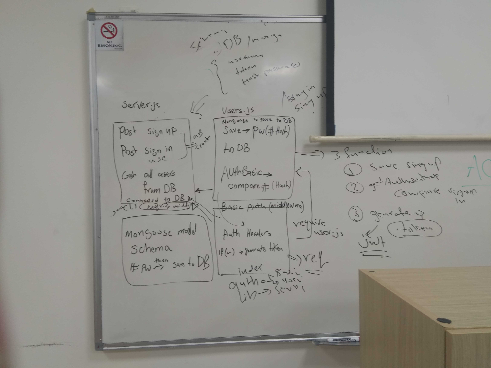

# LAB - Class 11

## Authentication

### Author: Muna and Mai 

### Links and Resources

- [submission PR](https://github.com/401-advanced-javascript-muna/lab-11-Authentication/pull/1)
- [ci/cd](https://github.com/401-advanced-javascript-muna/lab-11-Authentication/actions) (GitHub Actions)

#### How to initialize/run your application (where applicable)

-  `node index.js`

-  `echo '{"username":"name","password":"pass"}' | http post :3000/signup`to signup

-  `http post :3000/signin -a username:password` to signin

#### Tests

#### UML

Link to an image of the UML for your application and response to events

